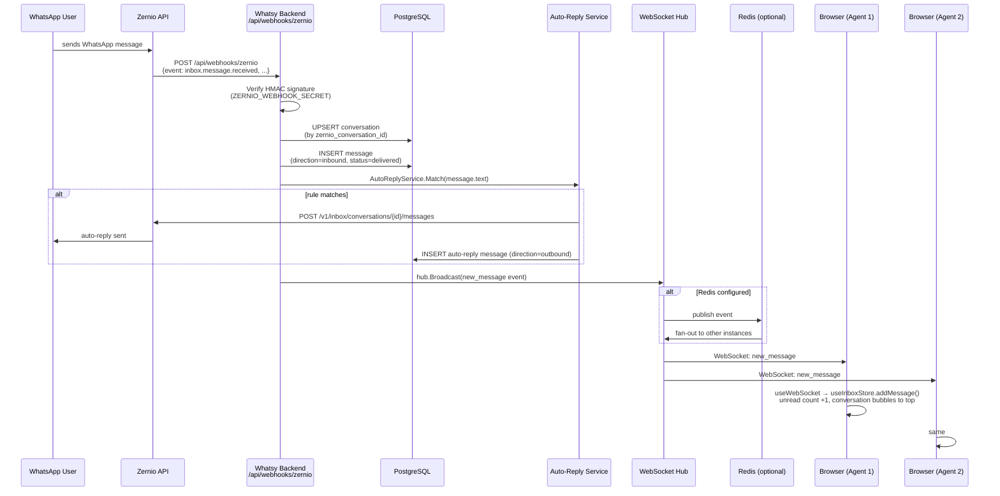
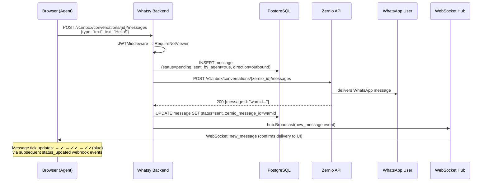
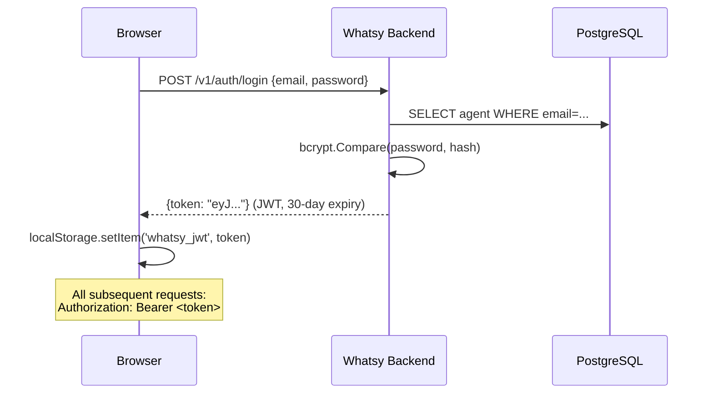
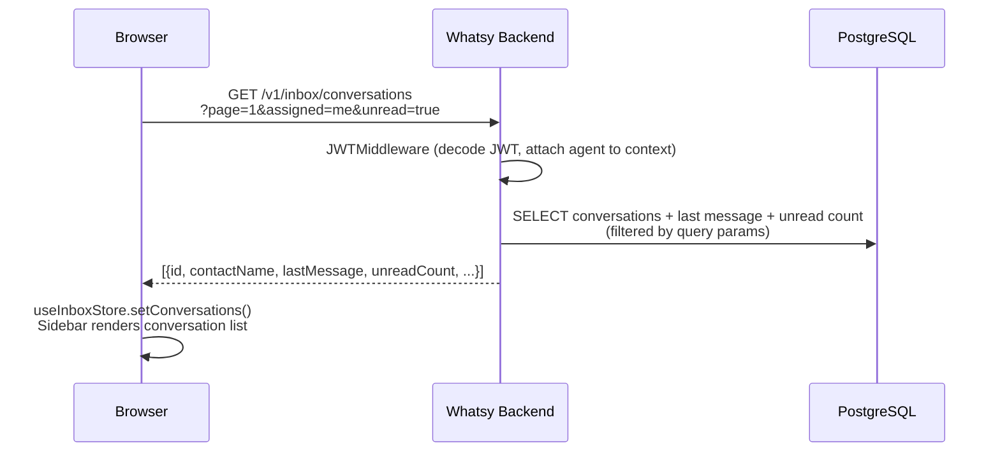
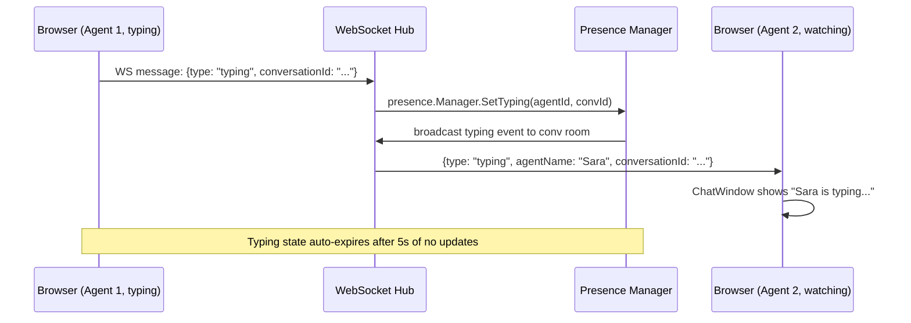
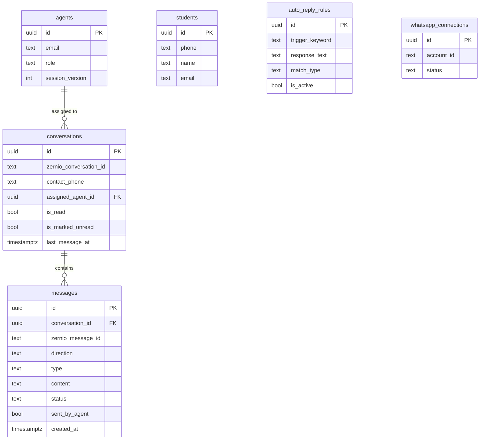

# Whatsy — Data Flow

End-to-end data flow for the Whatsy WhatsApp Shared Inbox. Covers all major paths: inbound messages, outbound replies, auth, media, sync, and presence.

---

## 1. Inbound Message (Critical Path)

A WhatsApp user sends a message → agents see it in real time.



### Code path
1. `POST /api/webhooks/zernio` → `internal/handler/handler.go:HandleWebhook()`
2. → `internal/zernio/webhook.go:Verify()` (HMAC check)
3. → `internal/service/chat_service.go:HandleInbound()`
4. → `internal/repository/conversation_repo.go:Upsert()`
5. → `internal/repository/message_repo.go:Insert()`
6. → `internal/service/auto_reply.go:Match()`
7. → `internal/websocket/hub.go:Broadcast()`
8. → `whatsy-frontend/src/store/useWebSocket.ts` (event handler)
9. → `whatsy-frontend/src/store/useInboxStore.ts` (state update)

---

## 2. Agent Sends a Reply (Outbound Path)



### Code path
1. `POST /v1/inbox/conversations/{id}/messages` → `handler.go:SendMessage()`
2. → `internal/service/chat_service.go:SendMessage()`
3. → `internal/repository/message_repo.go:Insert()` (status=pending)
4. → `internal/zernio/client.go:SendMessage()`
5. On success → `message_repo.Update()` (status=sent)
6. → `websocket/hub.go:Broadcast()`

### Stuck message recovery
On server startup, `chatService.RetryStuckMessages()` finds any messages in `pending` state older than 60s and retries the Zernio API call. This handles messages stuck by a killed deploy.

---

## 3. Agent Login



**Session invalidation:** The `agents` table has a `session_version` column. When an agent logs in from a new device, their `session_version` increments. The JWT middleware checks the version on every request — an old token with a stale version returns `{"error": "session_invalidated"}`, triggering the frontend's `whatsy:session_invalidated` event and redirecting to `/login`.

---

## 4. Load Inbox (Conversations List)



---

## 5. Real-Time Presence (Typing Indicators)



---

## 6. Media Flow

### Outbound (agent sends image/file)
```
Browser → POST /v1/whatsapp/upload (multipart)
→ uploadHandler proxies to Zernio media upload API
→ Zernio returns mediaId
→ Browser sends message with {type: "image", mediaId: "..."}
→ Standard outbound message flow (section 2)
```

### Inbound (agent views image received from contact)
```
Browser needs to display image from Zernio CDN
→ GET /v1/whatsapp/media/{mediaId}   (avoids CORS, keeps ZERNIO_API_KEY server-side)
→ mediaHandler proxies request to Zernio with API key
→ streams bytes back to browser
```

---

## 7. Background Sync

Runs at startup and every 10 minutes. Heals missed webhook events and `+unknown-` phone entries.

```
syncHandler.SyncSince(ctx, since)
→ GET https://zernio.com/api/v1/inbox/conversations?platform=whatsapp&updatedSince=<timestamp>
→ For each conversation: UPSERT in DB (conversation + contact phone/name)
→ Log: "N conversations upserted"
```

Startup sync covers the last 30 days. Incremental syncs use `lastSync` timestamp.

---

## 8. Message Delivery Status Updates

```
Zernio fires: POST /api/webhooks/zernio {event: inbox.message.status_updated}
→ handler.HandleWebhook()
→ message_repo.UpdateStatus(zernio_message_id, status)
→ hub.Broadcast(message_status event)
→ Browser: MessageBubble updates tick (✓ sent → ✓✓ delivered → ✓✓ blue = read)
```

---

## Database Relationships



---

## Environment Variables & Secrets

| Variable | Used in | Purpose |
|---|---|---|
| `DATABASE_URL` | All DB operations | Supabase PostgreSQL connection |
| `JWT_SECRET` | `pkg/utils/jwt.go` | Sign + verify agent session tokens |
| `ZERNIO_API_KEY` | `internal/zernio/client.go` | All outbound Zernio API calls |
| `ZERNIO_WEBHOOK_SECRET` | `internal/zernio/webhook.go` | HMAC-SHA256 webhook signature verification |
| `REDIS_URL` | `internal/redispub/pubsub.go` | Multi-instance WebSocket fan-out (optional) |
| `PORT` | `cmd/server/main.go` | HTTP server port (default 8080) |
| `FRONTEND_URL` / `FRONTEND_URL_2` | `cmd/server/main.go` | Additional CORS origins |

**Secret storage:** All secrets are in `whatsy-backend/.env` (gitignored). In production, set as Railway environment variables. Never commit secrets — `.env.example` has documented placeholders only.

---

## WebSocket Event Types

Defined in `internal/websocket/events.go`:

| Event type | Direction | Payload | Triggers |
|---|---|---|---|
| `new_message` | server → browser | message object | New inbound or outbound message |
| `message_status` | server → browser | `{messageId, status}` | Delivery status update |
| `typing` | server → browser | `{agentName, conversationId}` | Agent typing indicator |
| `presence` | server → browser | `{agentId, status}` | Agent online/offline |
| `conversation_assigned` | server → browser | `{conversationId, agentId}` | Conversation reassigned |
| `conversation_read` | server → browser | `{conversationId}` | Marked as read |
