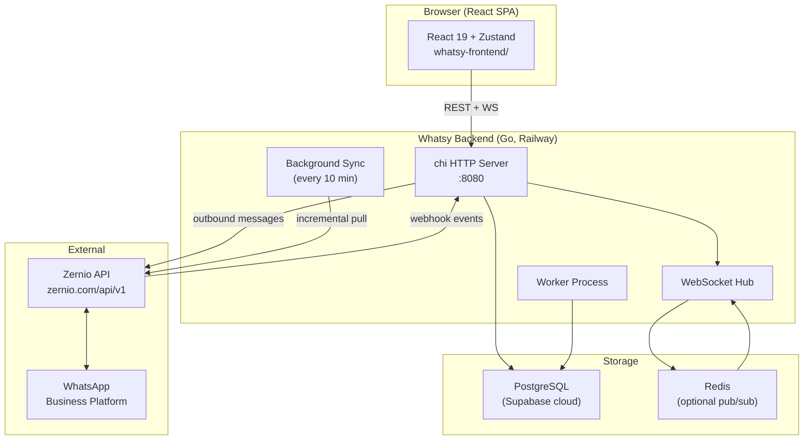

# Whatsy — Project Map

Top-level architecture, folder purposes, and key entry points.

---

## System Architecture



---

## Folder Map

### Root

```
whatsy/
├── whatsy-backend/          # Go HTTP server + background worker
├── whatsy-frontend/         # React SPA
├── docs/                    # 893 Zernio API Markdown reference docs (AI context)
├── resources/               # UI component references, repo lists
├── scripts/                 # CLI swarm + utility scripts
├── .claude/                 # Claude Code config, session artifacts
├── docker-compose.yml       # Local full-stack dev
├── AGENT_ONBOARDING.md      # Fresh-agent onboarding (start here)
├── PROJECT_MAP.md           # THIS FILE
├── DATA_FLOW.md             # Data flow with Mermaid diagrams
├── ROADMAP.md               # Unimplemented features backlog
├── CLAUDE.md                # Claude Code project instructions
├── CLAUDE_ZERNIO_API_MASTER.md  # 727-operation Zernio API reference
├── openapi.yaml             # Official Zernio OpenAPI 3.x spec
├── llms.txt / llms-full.txt # Zernio doc page index / raw dump
└── FILE_MAP.md              # Legacy file map (describes KB structure)
```

### Backend (`whatsy-backend/`)

```
whatsy-backend/
├── cmd/
│   ├── server/main.go       # Entry: router, middleware, routes, startup goroutines
│   └── worker/main.go       # Background worker entry
├── internal/
│   ├── config/config.go     # Env var loading
│   ├── handler/
│   │   ├── handler.go       # Inbox: conversations, messages, webhook, WebSocket
│   │   ├── agent.go         # Agent CRUD, invite, stats, me/profile
│   │   ├── auth.go          # Register, Login
│   │   ├── auto_reply.go    # Auto-reply rule CRUD
│   │   ├── broadcast.go     # Broadcast send
│   │   ├── canned_response.go # Canned response CRUD + search
│   │   ├── flow.go          # WhatsApp Flows CRUD + publish
│   │   ├── media.go         # Media proxy/download from Zernio
│   │   ├── middleware.go    # JWTMiddleware, RequireAdmin, RequireNotViewer
│   │   ├── ratelimit.go     # IP-based rate limiter
│   │   ├── student.go       # Contact CRUD (named "student" — naming artifact)
│   │   ├── sync.go          # Conversation sync from Zernio
│   │   ├── template.go      # WhatsApp template list/create
│   │   ├── upload.go        # Media upload to Zernio
│   │   └── whatsapp_connection.go # WhatsApp account connect/disconnect/QR
│   ├── service/
│   │   ├── chat_service.go  # Core: send/receive messages, retry stuck, inbound webhook
│   │   ├── auto_reply.go    # Rule matching + execution
│   │   └── tag_service.go   # Conversation tag management
│   ├── repository/
│   │   ├── conversation_repo.go  # DB queries: conversations
│   │   └── message_repo.go      # DB queries: messages
│   ├── domain/
│   │   ├── conversation.go  # Conversation struct
│   │   ├── message.go       # Message struct
│   │   ├── student.go       # Contact/customer struct
│   │   └── presence.go      # Presence state struct
│   ├── zernio/
│   │   ├── client.go        # Zernio API HTTP client
│   │   ├── events.go        # Zernio webhook event types
│   │   └── webhook.go       # Webhook HMAC signature verification
│   ├── websocket/
│   │   ├── hub.go           # Broadcast hub, room management
│   │   ├── client.go        # Per-connection read/write goroutines
│   │   └── events.go        # WS event type definitions
│   ├── presence/
│   │   ├── manager.go       # Agent online/typing presence state
│   │   └── lock.go          # Presence lock helpers
│   ├── redispub/
│   │   └── pubsub.go        # Redis pub/sub relay for multi-instance WS
│   └── eventlog/
│       └── eventlog.go      # Event logging
├── pkg/
│   └── utils/
│       ├── jwt.go           # JWT sign/verify
│       └── password.go      # bcrypt helpers
├── migrations/              # SQL files (12) — applied by Go runner on startup
├── supabase/
│   ├── migrations/          # Supabase CLI format (6 files — partial subset)
│   └── config.toml          # Supabase project config
├── .env.example             # All env vars documented
├── Dockerfile               # Production image
├── Dockerfile.worker        # Worker image
├── railway.toml             # Railway deploy config
└── go.mod / go.sum
```

### Frontend (`whatsy-frontend/`)

```
whatsy-frontend/
├── src/
│   ├── main.tsx             # React root mount
│   ├── App.tsx              # SPA router, auth guard, session invalidation, WS mount
│   ├── api/inbox.ts         # All REST fetch calls (API client layer)
│   ├── lib/auth.ts          # JWT decode, isAdmin(), isViewer()
│   ├── store/
│   │   ├── useInboxStore.ts # Zustand: conversations, active conv, messages, filters
│   │   ├── useWebSocket.ts  # WS connection lifecycle + event dispatch to store
│   │   └── useLanguageStore.ts # Language preference (AR/EN)
│   ├── i18n/translations.ts # All UI strings — AR + EN
│   ├── components/
│   │   ├── WhatsAppInboxApp.tsx  # Main inbox layout
│   │   ├── Sidebar.tsx      # Conversation list, search, unread badges
│   │   ├── ChatWindow.tsx   # Message thread, date separators, header actions
│   │   ├── ChatInput.tsx    # Text input, attachment picker, send
│   │   ├── MessageBubble.tsx # Inbound/outbound bubbles, media, delivery ticks
│   │   ├── ConversationRow.tsx  # Single row in sidebar
│   │   ├── NavBar.tsx       # Side navigation
│   │   ├── VoiceNotePlayer.tsx  # Audio playback
│   │   ├── ImageLightbox.tsx    # Full-screen image viewer
│   │   ├── DarkModeToggle.tsx   # Theme toggle
│   │   ├── ChangePasswordModal.tsx # Password change dialog
│   │   └── types.ts         # Shared TypeScript types
│   ├── pages/
│   │   ├── LoginPage.tsx
│   │   ├── StudentsPage.tsx      # Contact management
│   │   ├── AutoReplyPage.tsx     # Auto-reply rules (admin)
│   │   ├── BroadcastPage.tsx     # Broadcast send (admin)
│   │   ├── TeamPage.tsx          # Agent management + stats (admin)
│   │   └── WhatsAppConnectionPage.tsx # WhatsApp account connect (admin)
│   ├── index.css
│   └── vite-env.d.ts
├── index.html
├── vite.config.ts
├── tailwind.config.js
├── tsconfig.json
├── Dockerfile               # nginx + built SPA
├── nginx.conf / nginx.conf.template
└── railway.toml
```

---

## Key Entry Points

| Goal | File | Detail |
|---|---|---|
| Start backend | `whatsy-backend/cmd/server/main.go` | `go run ./cmd/server` |
| All API routes | `whatsy-backend/cmd/server/main.go` | `r.Get/Post/...` blocks |
| Add API endpoint | `internal/handler/<feature>.go` + `main.go` | Handler + route registration |
| Frontend routing | `whatsy-frontend/src/App.tsx` | `AppContent()` switch |
| Add page | `src/pages/` + `AppContent()` + `NavBar` | |
| WebSocket events (backend) | `internal/websocket/events.go` | Event type definitions |
| WebSocket events (frontend) | `src/store/useWebSocket.ts` | Event handlers |
| DB schema | `whatsy-backend/migrations/*.sql` | 12 files, applied in alpha order |
| Zernio API calls | `internal/zernio/client.go` | All outbound WhatsApp API calls |
| Send message (core) | `internal/service/chat_service.go` | `SendMessage()` |
| Inbound webhook (core) | `internal/handler/handler.go` | `HandleWebhook()` → `chat_service` |

---

## API Routes Summary

### Public
| Method | Path | Handler |
|---|---|---|
| `GET` | `/health` | inline |
| `POST` | `/v1/auth/register` | `authHandler.Register` |
| `POST` | `/v1/auth/login` | `authHandler.Login` |
| `POST` | `/api/webhooks/zernio` | `h.HandleWebhook` |

### Authenticated (JWT required)
| Method | Path | Handler | Role |
|---|---|---|---|
| `GET` | `/v1/inbox/conversations` | `h.ListConversations` | all |
| `GET` | `/v1/inbox/conversations/{id}/messages` | `h.GetMessages` | all |
| `POST` | `/v1/inbox/conversations/{id}/messages` | `h.SendMessage` | agent+ |
| `POST` | `/v1/inbox/conversations/{id}/read` | `h.MarkRead` | agent+ |
| `POST` | `/v1/inbox/conversations/{id}/assign` | `h.AssignConversation` | agent+ |
| `GET` | `/v1/inbox/search` | `h.SearchMessages` | all |
| `GET` | `/v1/agents` | `agentHandler.List` | all |
| `GET` | `/v1/agents/me` | `agentHandler.Me` | all |
| `POST` | `/v1/agents/invite` | `agentHandler.InviteAgent` | admin |
| `GET` | `/v1/agents/stats` | `agentHandler.TeamStats` | all |
| `GET` | `/v1/students` | `studentHandler.List` | all |
| `POST` | `/v1/students` | `studentHandler.Create` | agent+ |
| `GET` | `/v1/auto-reply-rules` | `autoReplyHandler.List` | all |
| `POST` | `/v1/auto-reply-rules` | `autoReplyHandler.Create` | admin |
| `GET` | `/v1/canned-responses` | `cannedResponseHandler.List` | all |
| `POST` | `/v1/canned-responses` | `cannedResponseHandler.Create` | agent+ |
| `GET` | `/v1/whatsapp/templates` | `templateHandler.ListTemplates` | all |
| `POST` | `/v1/whatsapp/broadcasts` | `broadcastHandler.SendBroadcast` | admin |
| `GET` | `/v1/whatsapp/flows` | `flowHandler.List` | all |
| `GET` | `/v1/whatsapp/connection/status` | `waConnHandler.Status` | all |
| `POST` | `/v1/whatsapp/connection/connect` | `waConnHandler.Connect` | admin |
| `GET` | `/ws` | `h.ServeWebSocket` | all |

---

## Agent Role Matrix

| Endpoint pattern | admin | agent | viewer |
|---|---|---|---|
| Read conversations/messages | ✅ | ✅ | ✅ |
| Send messages | ✅ | ✅ | ❌ |
| Assign conversations | ✅ | ✅ | ❌ |
| Manage auto-reply rules | ✅ | ❌ | ❌ |
| Invite agents | ✅ | ❌ | ❌ |
| WhatsApp connection | ✅ | ❌ | ❌ |
| Broadcasts | ✅ | ❌ | ❌ |

---

## Database Tables

| Table | Key columns | Purpose |
|---|---|---|
| `agents` | id, email, role, session_version | Authenticated users |
| `conversations` | id, zernio_conversation_id, contact_phone, assigned_agent_id, is_read | WhatsApp conversations |
| `messages` | id, conversation_id, direction, type, content, status, sent_by_agent | Individual messages |
| `students` | id, phone, name, email | Contacts/customers (naming artifact) |
| `canned_responses` | id, shortcut, content | Quick reply templates |
| `auto_reply_rules` | id, trigger_keyword, response_text, match_type, is_active | Auto-reply config |
| `broadcasts` | id, template_id, status, recipient_count | Bulk send records |
| `whatsapp_flows` | id, zernio_flow_id, name, status | Interactive form flows |
| `whatsapp_connections` | id, account_id, status | WhatsApp account binding |
| `schema_migrations` | version, applied_at | Migration tracking |
