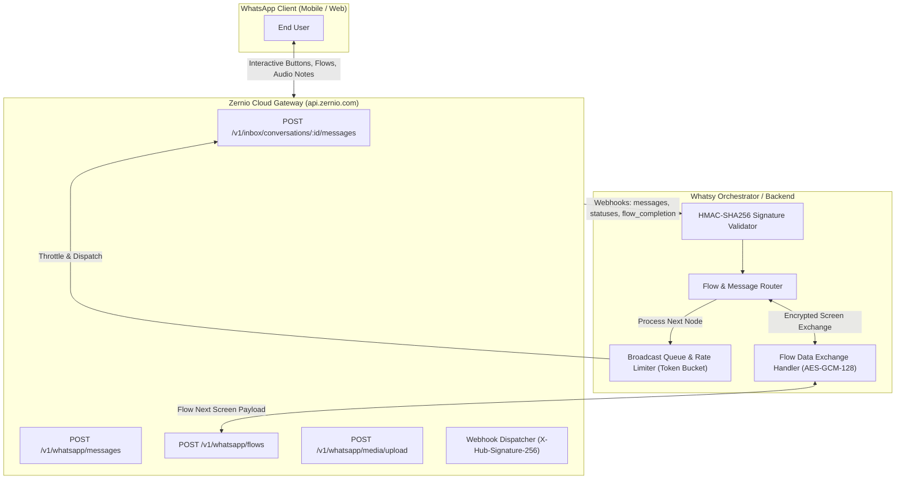

# WhatsApp Functions, Flow Builders, Bots, and CRM Repositories

This document provides a comprehensive technical catalog, architectural comparison, and ready-to-use production code implementations for building WhatsApp conversational bots, flow automation engines, broadcast systems, and CRM integrations powered by the **Zernio API** (`https://api.zernio.com`) and modern open-source foundations.

---

## 1. Top Open-Source GitHub Repositories Comparison

| Repository | Tech Stack | Architecture & Engine | Stars | Key Features & Highlights | GitHub URL |
| :--- | :--- | :--- | :--- | :--- | :--- |
| **`codigoencasa/builderbot`** | Node.js, TypeScript, Polka / Express | Modular Provider Architecture (Baileys / Meta Cloud / WPPConnect), state machine flow engine | ~5.8k | Declarative flow routing (`addKeyword`, `addAction`), blacklists, multi-session memory, built-in dialogue trees, voice-to-text plugins. | [github.com/codigoencasa/builderbot](https://github.com/codigoencasa/builderbot) |
| **`theabhipatel/wa_flow_builder`** | React, React Flow, Node.js, Tailwind CSS | Node-edge DAG visual flow canvas | ~850+ | Visual drag-and-drop designer for WhatsApp Flows (Meta JSON screens, forms, date-time pickers, branch conditional routing). | [github.com/theabhipatel/wa_flow_builder](https://github.com/theabhipatel/wa_flow_builder) |
| **`baptisteArno/typebot.io`** | Next.js, TypeScript, Prisma, PostgreSQL, Docker | Visual block-based conversational execution engine with Webhook & WhatsApp triggers | ~18.5k | Advanced visual bot builder, native WhatsApp integration, condition blocks, script runners, rich media, analytics funnel. | [github.com/baptisteArno/typebot.io](https://github.com/baptisteArno/typebot.io) |
| **`hexabot-dev/hexabot`** | Node.js, NestJS, Angular, MongoDB / PostgreSQL | Multi-channel AI agent & conversational orchestrator | ~2.1k | NLU / LLM tool-calling integrations, intent classification, multi-language dialogue trees, omnichannel handoff. | [github.com/hexabot-dev/hexabot](https://github.com/hexabot-dev/hexabot) |
| **`glific/glific`** | Elixir, Phoenix, Absinthe GraphQL, PostgreSQL | Distributed fault-tolerant actor system (BEAM) | ~750+ | Built specifically for NGOs/enterprise scale: complex broadcast campaigns, contact management, multi-agent triaging, BigQuery sync. | [github.com/glific/glific](https://github.com/glific/glific) |
| **`devlikeapro/waha`** | TypeScript, NestJS, Swagger, Puppeteer / Core | Microservice HTTP REST API Gateway | ~4.6k | Multi-engine WhatsApp REST Gateway, WebSocket event streams, media proxies, session management, Swagger UI docs. | [github.com/devlikeapro/waha](https://github.com/devlikeapro/waha) |
| **`chatwoot/chatwoot`** | Ruby on Rails, Vue.js, PostgreSQL, Redis, Sidekiq | Omnichannel customer communication & CRM platform | ~21.5k | Shared team inbox, multi-agent assignment, collision detection, custom attributes, private notes, SLA policies, CSAT surveys. | [github.com/chatwoot/chatwoot](https://github.com/chatwoot/chatwoot) |
| **`EvolutionAPI/evolution-api`** | TypeScript, Node.js, Express / Fastify, Baileys | High-throughput REST API with webhook event dispatchers | ~5.2k | Multi-instance management, audio-to-opus transcoding, WhatsApp Flows support, Typebot & Chatwoot native bridges. | [github.com/EvolutionAPI/evolution-api](https://github.com/EvolutionAPI/evolution-api) |

---

## 2. WhatsApp Business Functions Deep-Dive



### 2.1 Interactive Messages
WhatsApp supports structured interactive components allowing higher conversion and lower friction than unstructured text:
1. **Quick Reply Buttons:** Up to 3 predefined response buttons. Great for Yes/No, Confirmation, or quick decision branches.
2. **List Menus:** Up to 10 options categorized into sections with titles and descriptions. Optimal for product catalogs, service choices, or support departments.
3. **Call-to-Action (CTA) URL Buttons:** Direct URLs or phone dial triggers embedded into message cards.

### 2.2 WhatsApp Flows
WhatsApp Flows provide native, secure, interactive mini-apps inside WhatsApp chat:
- **Multi-Screen Forms:** User fills lead forms, surveys, or address details without leaving the chat.
- **Appointment & Table Booking:** Dynamic date pickers, time slot availability checks via real-time endpoint sync (`data_exchange`).
- **End-to-End Encryption:** Flow payloads sent between Meta/Zernio and your server are encrypted using AES-GCM-128 with RSA key exchange.

### 2.3 Media Handling & Transcoding
- **Voice Notes (PTT):** Standard WhatsApp voice messages require **Ogg Opus** audio encoding (`audio/ogg; codecs=opus`). Uploading plain MP3 files displays as an audio file rather than a waveform voice note.
- **PDF Documents & Invoices:** Base64 or publicly accessible URL with filename and page preview attributes.
- **Video Previews:** MP4 containers with H.264 video and AAC audio.

### 2.4 High-Throughput Broadcast Engine
- **Token Bucket / Leaky Bucket Rate Limiting:** WhatsApp Cloud API enforces strict tier limits (Tier 1: 1k users/24h, Tier 2: 10k, Tier 3: 100k, Tier 4: Unlimited).
- **Variable Replacement & Localization:** Template variable binding (`{{1}}`, `{{2}}`), fallback handling, and contact locale mapping.
- **Delivery State Tracking:** Multi-stage status lifecycle (`queued` ➔ `sent` ➔ `delivered` ➔ `read` ➔ `failed`).

### 2.5 Webhook Verification & HMAC Signature Security
- Validate incoming webhook requests using SHA-256 HMAC digest in header `x-hub-signature-256` or `x-zernio-signature`.
- Prevent replay attacks via timestamp and payload verification.

---

## 3. Production Code Implementations

### 3.1 Interactive Messages (List Menus, Reply Buttons, CTA)

#### TypeScript / Node.js
```typescript
import axios from 'axios';

const ZERNIO_BASE_URL = 'https://api.zernio.com';
const ZERNIO_API_KEY = process.env.ZERNIO_API_KEY!;

interface QuickReplyButton {
  id: string;
  title: string;
}

interface ListSectionRow {
  id: string;
  title: string;
  description?: string;
}

interface ListSection {
  title: string;
  rows: ListSectionRow[];
}

/**
 * Send Interactive Quick Reply Buttons (Max 3 buttons)
 */
export async function sendReplyButtons(
  conversationId: string,
  bodyText: string,
  buttons: QuickReplyButton[],
  headerText?: string,
  footerText?: string
) {
  const url = `${ZERNIO_BASE_URL}/v1/inbox/conversations/${conversationId}/messages`;
  
  const payload = {
    type: 'interactive',
    interactive: {
      type: 'button',
      header: headerText ? { type: 'text', text: headerText } : undefined,
      body: { text: bodyText },
      footer: footerText ? { text: footerText } : undefined,
      action: {
        buttons: buttons.slice(0, 3).map((btn) => ({
          type: 'reply',
          reply: {
            id: btn.id,
            title: btn.title.slice(0, 20), // WhatsApp 20-char limit
          },
        })),
      },
    },
  };

  const response = await axios.post(url, payload, {
    headers: {
      Authorization: `Bearer ${ZERNIO_API_KEY}`,
      'Content-Type': 'application/json',
    },
  });

  return response.data;
}

/**
 * Send Interactive List Menu (Up to 10 options)
 */
export async function sendListMenu(
  conversationId: string,
  bodyText: string,
  buttonText: string,
  sections: ListSection[],
  title?: string
) {
  const url = `${ZERNIO_BASE_URL}/v1/inbox/conversations/${conversationId}/messages`;

  const payload = {
    type: 'interactive',
    interactive: {
      type: 'list',
      header: title ? { type: 'text', text: title } : undefined,
      body: { text: bodyText },
      action: {
        button: buttonText.slice(0, 20),
        sections: sections.map((sec) => ({
          title: sec.title,
          rows: sec.rows.map((row) => ({
            id: row.id,
            title: row.title.slice(0, 24),
            description: row.description?.slice(0, 72),
          })),
        })),
      },
    },
  };

  const response = await axios.post(url, payload, {
    headers: {
      Authorization: `Bearer ${ZERNIO_API_KEY}`,
      'Content-Type': 'application/json',
    },
  });

  return response.data;
}

/**
 * Send Call-To-Action (CTA) URL Button
 */
export async function sendCtaUrlButton(
  conversationId: string,
  bodyText: string,
  displayText: string,
  targetUrl: string,
  headerText?: string
) {
  const url = `${ZERNIO_BASE_URL}/v1/inbox/conversations/${conversationId}/messages`;

  const payload = {
    type: 'interactive',
    interactive: {
      type: 'cta_url',
      header: headerText ? { type: 'text', text: headerText } : undefined,
      body: { text: bodyText },
      action: {
        name: 'cta_url',
        parameters: {
          display_text: displayText,
          url: targetUrl,
        },
      },
    },
  };

  const response = await axios.post(url, payload, {
    headers: {
      Authorization: `Bearer ${ZERNIO_API_KEY}`,
      'Content-Type': 'application/json',
    },
  });

  return response.data;
}
```

#### Python
```python
import os
import requests
from typing import List, Dict, Optional

ZERNIO_BASE_URL = "https://api.zernio.com"
ZERNIO_API_KEY = os.getenv("ZERNIO_API_KEY", "")

def send_reply_buttons(
    conversation_id: str,
    body_text: str,
    buttons: List[Dict[str, str]],
    header_text: Optional[str] = None,
    footer_text: Optional[str] = None
) -> dict:
    """Send up to 3 quick reply buttons."""
    url = f"{ZERNIO_BASE_URL}/v1/inbox/conversations/{conversation_id}/messages"
    
    formatted_buttons = [
        {
            "type": "reply",
            "reply": {
                "id": b["id"],
                "title": b["title"][:20]
            }
        }
        for b in buttons[:3]
    ]

    interactive_obj = {
        "type": "button",
        "body": {"text": body_text},
        "action": {"buttons": formatted_buttons}
    }
    if header_text:
        interactive_obj["header"] = {"type": "text", "text": header_text}
    if footer_text:
        interactive_obj["footer"] = {"text": footer_text}

    resp = requests.post(
        url,
        json={"type": "interactive", "interactive": interactive_obj},
        headers={
            "Authorization": f"Bearer {ZERNIO_API_KEY}",
            "Content-Type": "application/json"
        },
        timeout=10
    )
    resp.raise_for_status()
    return resp.json()

def send_list_menu(
    conversation_id: str,
    body_text: str,
    button_label: str,
    sections: List[Dict],
    title: Optional[str] = None
) -> dict:
    """Send interactive list menu with up to 10 items across sections."""
    url = f"{ZERNIO_BASE_URL}/v1/inbox/conversations/{conversation_id}/messages"
    
    interactive_obj = {
        "type": "list",
        "body": {"text": body_text},
        "action": {
            "button": button_label[:20],
            "sections": sections
        }
    }
    if title:
        interactive_obj["header"] = {"type": "text", "text": title}

    resp = requests.post(
        url,
        json={"type": "interactive", "interactive": interactive_obj},
        headers={
            "Authorization": f"Bearer {ZERNIO_API_KEY}",
            "Content-Type": "application/json"
        },
        timeout=10
    )
    resp.raise_for_status()
    return resp.json()
```

---

### 3.2 WhatsApp Flows (Native Multi-Screen Forms & Booking)

#### TypeScript / Node.js (Triggering Flow & Flow Data Exchange Endpoint)
```typescript
import express, { Request, Response } from 'express';
import axios from 'axios';

const ZERNIO_BASE_URL = 'https://api.zernio.com';
const ZERNIO_API_KEY = process.env.ZERNIO_API_KEY!;

/**
 * Trigger a WhatsApp Flow on the recipient's phone
 */
export async function sendWhatsAppFlowMessage(
  conversationId: string,
  flowId: string,
  flowToken: string,
  screenId: string,
  ctaText: string,
  bodyText: string
) {
  const url = `${ZERNIO_BASE_URL}/v1/inbox/conversations/${conversationId}/messages`;

  const payload = {
    type: 'interactive',
    interactive: {
      type: 'flow',
      body: { text: bodyText },
      action: {
        name: 'flow',
        parameters: {
          flow_message_version: '3',
          flow_token: flowToken,
          flow_id: flowId,
          flow_cta: ctaText,
          flow_action: 'navigate',
          flow_action_payload: {
            screen: screenId,
            data: {
              greeting: 'Welcome to Whatsy Appointment Scheduler',
            },
          },
        },
      },
    },
  };

  const response = await axios.post(url, payload, {
    headers: {
      Authorization: `Bearer ${ZERNIO_API_KEY}`,
      'Content-Type': 'application/json',
    },
  });

  return response.data;
}

/**
 * Express router handling WhatsApp Flow Data Exchange webhook
 */
export const flowDataExchangeRouter = express.Router();

flowDataExchangeRouter.post('/api/whatsapp/flow-endpoint', async (req: Request, res: Response) => {
  const { action, screen, data, flow_token } = req.body;

  // 1. WhatsApp Health Check / Ping
  if (action === 'ping') {
    return res.json({
      version: '3.0',
      data: { status: 'active' },
    });
  }

  // 2. Initial Screen Data Initialization
  if (action === 'INIT') {
    return res.json({
      version: '3.0',
      screen: 'APPOINTMENT_SCREEN',
      data: {
        department_options: [
          { id: 'sales', title: 'Sales & Onboarding' },
          { id: 'tech', title: 'Technical Support' },
          { id: 'billing', title: 'Billing & Invoicing' },
        ],
        available_slots: ['09:00 AM', '11:30 AM', '02:00 PM', '04:30 PM'],
      },
    });
  }

  // 3. User Submits Form Screen
  if (action === 'data_exchange' && screen === 'APPOINTMENT_SCREEN') {
    const { selected_slot, department, customer_email } = data;
    console.log(`[Flow Completed] Token: ${flow_token}, Slot: ${selected_slot}, Email: ${customer_email}`);

    // Return Next Screen (e.g., Confirmation)
    return res.json({
      version: '3.0',
      screen: 'CONFIRMATION_SCREEN',
      data: {
        confirmation_code: `BK-${Math.floor(100000 + Math.random() * 900000)}`,
        message: 'Your appointment is booked successfully!',
      },
    });
  }

  return res.status(400).json({ error: 'Unsupported action or screen' });
});
```

#### Python (Flask WhatsApp Flow Data Exchange)
```python
from flask import Flask, request, jsonify

app = Flask(__name__)

@app.route("/api/whatsapp/flow-endpoint", methods=["POST"])
def whatsapp_flow_data_exchange():
    payload = request.get_json(force=True)
    action = payload.get("action")
    screen = payload.get("screen")
    data = payload.get("data", {})
    flow_token = payload.get("flow_token")

    if action == "ping":
        return jsonify({"version": "3.0", "data": {"status": "active"}})

    if action == "INIT":
        return jsonify({
            "version": "3.0",
            "screen": "BOOKING_STEP_1",
            "data": {
                "services": [
                    {"id": "s1", "title": "Standard Consultation"},
                    {"id": "s2", "title": "Premium Architecture Review"}
                ]
            }
        })

    if action == "data_exchange" and screen == "BOOKING_STEP_1":
        # Save record to database
        service_id = data.get("service_id")
        return jsonify({
            "version": "3.0",
            "screen": "SUCCESS_SCREEN",
            "data": {
                "status_text": "Booking Confirmed",
                "reference_id": f"REF-{flow_token[:8].upper()}"
            }
        })

    return jsonify({"error": "Invalid request"}), 400
```

---

### 3.3 Media Handling & Transcoding (Audio Opus, Invoices, Video)

#### TypeScript / Node.js
```typescript
import axios from 'axios';
import FormData from 'form-data';
import fs from 'fs';

const ZERNIO_BASE_URL = 'https://api.zernio.com';
const ZERNIO_API_KEY = process.env.ZERNIO_API_KEY!;

/**
 * Send WhatsApp PTT (Push-To-Talk) Voice Note
 * Audio file must be encoded in ogg opus format (audio/ogg; codecs=opus)
 */
export async function sendVoiceNote(
  conversationId: string,
  audioUrlOrId: string,
  isUrl: boolean = true
) {
  const url = `${ZERNIO_BASE_URL}/v1/inbox/conversations/${conversationId}/messages`;

  const payload = {
    type: 'audio',
    audio: isUrl
      ? { link: audioUrlOrId }
      : { id: audioUrlOrId },
    // ptt=true triggers WhatsApp voice waveform player
    voice: true,
  };

  const response = await axios.post(url, payload, {
    headers: {
      Authorization: `Bearer ${ZERNIO_API_KEY}`,
      'Content-Type': 'application/json',
    },
  });

  return response.data;
}

/**
 * Send PDF Invoice / Document
 */
export async function sendDocument(
  conversationId: string,
  pdfUrl: string,
  filename: string,
  caption?: string
) {
  const url = `${ZERNIO_BASE_URL}/v1/inbox/conversations/${conversationId}/messages`;

  const payload = {
    type: 'document',
    document: {
      link: pdfUrl,
      filename: filename,
      caption: caption,
    },
  };

  const response = await axios.post(url, payload, {
    headers: {
      Authorization: `Bearer ${ZERNIO_API_KEY}`,
      'Content-Type': 'application/json',
    },
  });

  return response.data;
}

/**
 * Upload local file to Zernio WhatsApp media storage
 */
export async function uploadMediaToZernio(filePath: string, mimeType: string): Promise<string> {
  const form = new FormData();
  form.append('file', fs.createReadStream(filePath));
  form.append('type', mimeType);

  const response = await axios.post(`${ZERNIO_BASE_URL}/v1/whatsapp/media`, form, {
    headers: {
      Authorization: `Bearer ${ZERNIO_API_KEY}`,
      ...form.getHeaders(),
    },
  });

  // Returns { id: "media_id_xxx" }
  return response.data.id;
}
```

#### Python
```python
import os
import requests

ZERNIO_BASE_URL = "https://api.zernio.com"
ZERNIO_API_KEY = os.getenv("ZERNIO_API_KEY", "")

def send_voice_note(conversation_id: str, audio_url: str) -> dict:
    """Send voice note with native PTT player display."""
    url = f"{ZERNIO_BASE_URL}/v1/inbox/conversations/{conversation_id}/messages"
    payload = {
        "type": "audio",
        "audio": {"link": audio_url},
        "voice": True
    }
    resp = requests.post(
        url,
        json=payload,
        headers={"Authorization": f"Bearer {ZERNIO_API_KEY}"}
    )
    resp.raise_for_status()
    return resp.json()

def send_pdf_document(conversation_id: str, pdf_url: str, filename: str, caption: str = "") -> dict:
    """Send PDF document or invoice attachment."""
    url = f"{ZERNIO_BASE_URL}/v1/inbox/conversations/{conversation_id}/messages"
    payload = {
        "type": "document",
        "document": {
            "link": pdf_url,
            "filename": filename,
            "caption": caption
        }
    }
    resp = requests.post(
        url,
        json=payload,
        headers={"Authorization": f"Bearer {ZERNIO_API_KEY}"}
    )
    resp.raise_for_status()
    return resp.json()
```

---

### 3.4 Broadcast Engine (Rate-Limiting, Queuing & Variable Replacement)

#### TypeScript / Node.js
```typescript
import axios from 'axios';

interface BroadcastContact {
  conversationId: string;
  phone: string;
  variables: Record<string, string>; // e.g. { name: "Ahmed", order_id: "ORD-9921" }
}

interface BroadcastJob {
  templateName: string;
  languageCode: string;
  contacts: BroadcastContact[];
  messagesPerSecond?: number;
}

/**
 * High-performance broadcast engine with rate-limiting and variable replacement
 */
export class WhatsAppBroadcastEngine {
  private apiKey: string;
  private baseUrl = 'https://api.zernio.com';

  constructor(apiKey: string) {
    this.apiKey = apiKey;
  }

  private sleep(ms: number): Promise<void> {
    return new Promise((resolve) => setTimeout(resolve, ms));
  }

  public async executeBroadcast(job: BroadcastJob) {
    const rateLimitDelayMs = Math.ceil(1000 / (job.messagesPerSecond || 25));
    const results = {
      total: job.contacts.length,
      successful: 0,
      failed: 0,
      errors: [] as Array<{ phone: string; error: string }>,
    };

    console.log(`[Broadcast Started] Total recipients: ${job.contacts.length}. Throttle: ${job.messagesPerSecond || 25} msg/sec`);

    for (const contact of job.contacts) {
      try {
        await this.dispatchTemplateMessage(
          contact.conversationId,
          job.templateName,
          job.languageCode,
          contact.variables
        );
        results.successful++;
      } catch (err: any) {
        results.failed++;
        results.errors.push({
          phone: contact.phone,
          error: err.response?.data?.message || err.message,
        });
      }

      // Enforce rate-limiting interval between sends
      await this.sleep(rateLimitDelayMs);
    }

    console.log(`[Broadcast Completed] Sent: ${results.successful}, Failed: ${results.failed}`);
    return results;
  }

  private async dispatchTemplateMessage(
    conversationId: string,
    templateName: string,
    languageCode: string,
    variables: Record<string, string>
  ) {
    const url = `${this.baseUrl}/v1/inbox/conversations/${conversationId}/messages`;

    // Convert variables object into WhatsApp template parameter array
    const bodyParameters = Object.values(variables).map((val) => ({
      type: 'text',
      text: val,
    }));

    const payload = {
      type: 'template',
      template: {
        name: templateName,
        language: { code: languageCode },
        components: [
          {
            type: 'body',
            parameters: bodyParameters,
          },
        ],
      },
    };

    await axios.post(url, payload, {
      headers: {
        Authorization: `Bearer ${this.apiKey}`,
        'Content-Type': 'application/json',
      },
    });
  }
}
```

#### Python (Async Broadcast Dispatcher)
```python
import asyncio
import os
import httpx
from typing import List, Dict

ZERNIO_BASE_URL = "https://api.zernio.com"
ZERNIO_API_KEY = os.getenv("ZERNIO_API_KEY", "")

async def send_template_worker(
    client: httpx.AsyncClient,
    conversation_id: str,
    template_name: str,
    lang: str,
    variables: Dict[str, str],
    semaphore: asyncio.Semaphore
):
    async with semaphore:
        url = f"{ZERNIO_BASE_URL}/v1/inbox/conversations/{conversation_id}/messages"
        payload = {
            "type": "template",
            "template": {
                "name": template_name,
                "language": {"code": lang},
                "components": [
                    {
                        "type": "body",
                        "parameters": [{"type": "text", "text": val} for val in variables.values()]
                    }
                ]
            }
        }
        try:
            resp = await client.post(
                url,
                json=payload,
                headers={"Authorization": f"Bearer {ZERNIO_API_KEY}"},
                timeout=10.0
            )
            return resp.status_code == 200
        except Exception as e:
            return False

async def run_broadcast(contacts: List[Dict], template_name: str, concurrency_limit: int = 20):
    semaphore = asyncio.Semaphore(concurrency_limit)
    async with httpx.AsyncClient() as client:
        tasks = [
            send_template_worker(
                client,
                c["conversation_id"],
                template_name,
                c.get("lang", "en_US"),
                c.get("variables", {}),
                semaphore
            )
            for c in contacts
        ]
        results = await asyncio.gather(*tasks)
        print(f"Broadcast Finished. Total: {len(results)}, Success: {sum(results)}")
```

---

### 3.5 Webhook Verification & HMAC Signature Security

#### TypeScript / Node.js (Express Middleware)
```typescript
import crypto from 'crypto';
import { Request, Response, NextFunction } from 'express';

const ZERNIO_WEBHOOK_SECRET = process.env.ZERNIO_WEBHOOK_SECRET!;

export interface WebhookAuthenticatedRequest extends Request {
  rawBody?: Buffer;
}

/**
 * Middleware to capture raw request body for accurate HMAC digest computation
 */
export function captureRawBody(req: WebhookAuthenticatedRequest, _res: Response, buf: Buffer, encoding: BufferEncoding) {
  if (buf && buf.length) {
    req.rawBody = buf;
  }
}

/**
 * Verify incoming Zernio / Meta X-Hub-Signature-256
 */
export function verifyZernioSignature(req: WebhookAuthenticatedRequest, res: Response, next: NextFunction) {
  const signatureHeader = req.headers['x-hub-signature-256'] as string || req.headers['x-zernio-signature'] as string;

  if (!signatureHeader) {
    return res.status(401).json({ error: 'Missing webhook signature header' });
  }

  // Header format: "sha256=abcdef123456..."
  const [algo, signatureHash] = signatureHeader.split('=');
  if (algo !== 'sha256' || !signatureHash) {
    return res.status(401).json({ error: 'Malformed signature format' });
  }

  const rawPayload = req.rawBody || Buffer.from(JSON.stringify(req.body), 'utf8');

  const hmac = crypto.createHmac('sha256', ZERNIO_WEBHOOK_SECRET);
  const expectedHash = hmac.update(rawPayload).digest('hex');

  const isMatch = crypto.timingSafeEqual(
    Buffer.from(signatureHash, 'utf8'),
    Buffer.from(expectedHash, 'utf8')
  );

  if (!isMatch) {
    console.error('[Security Warning] Webhook HMAC signature mismatch rejected');
    return res.status(403).json({ error: 'Invalid HMAC signature' });
  }

  return next();
}
```

#### Python (FastAPI / Starlette Verification Decorator)
```python
import hmac
import hashlib
import os
from fastapi import FastAPI, Request, HTTPException, Header

app = FastAPI()
ZERNIO_WEBHOOK_SECRET = os.getenv("ZERNIO_WEBHOOK_SECRET", "")

@app.post("/api/webhooks/zernio")
async def handle_zernio_webhook(
    request: Request,
    x_hub_signature_256: str = Header(None)
):
    if not x_hub_signature_256 or not x_hub_signature_256.startswith("sha256="):
        raise HTTPException(status_code=401, detail="Missing or invalid signature header")

    received_sig = x_hub_signature_256.replace("sha256=", "")
    body_bytes = await request.body()

    computed_sig = hmac.new(
        key=ZERNIO_WEBHOOK_SECRET.encode("utf-8"),
        msg=body_bytes,
        digestmod=hashlib.sha256
    ).hexdigest()

    if not hmac.compare_digest(received_sig, computed_sig):
        raise HTTPException(status_code=403, detail="Signature mismatch")

    payload = await request.json()
    event_type = payload.get("type")
    print(f"Verified webhook received: {event_type}")

    return {"status": "ok"}
```

---

## 4. Integration Blueprint with Whatsy Inbox

To connect your Whatsy Inbox frontend and backend with these components:
1. **Interactive Messages:** Call `sendReplyButtons` or `sendListMenu` from the Whatsy message compose bar when agents trigger canned interaction shortcuts.
2. **WhatsApp Flows:** Embed flow triggers inside customer service onboarding or checkout dialogues; handle form payloads via `/api/whatsapp/flow-endpoint`.
3. **Voice & Document Attachments:** Route recorded audio notes directly through `sendVoiceNote` (with Opus audio tag) and documents via `sendDocument`.
4. **Broadcast Campaigns:** Connect the `WhatsAppBroadcastEngine` to your marketing lists with token-bucket rate limiting to protect business tier reputation.
5. **Webhook Security:** Protect your webhook router using `verifyZernioSignature` before broadcasting real-time updates to WebSocket or SSE subscribers.
