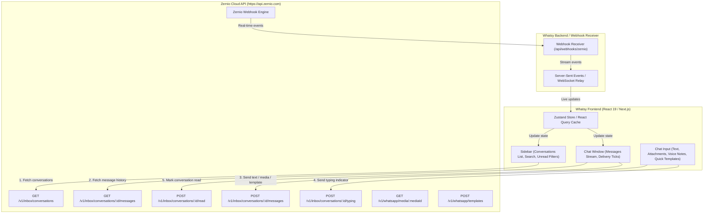

# WhatsApp UI & Inbox Repositories, Architecture, and Code Reference

This document serves as the comprehensive engineering guide and repository index for building **Whatsy**—a WhatsApp Web & Shared Team Inbox client powered by the **Zernio API** (`https://api.zernio.com`).

---

## 1. Top Open-Source GitHub Repositories Catalog

### WhatsApp Web Clones & UI Kits
| Repository | GitHub URL | Tech Stack | Key Features & Highlights | Best Use-Case for Whatsy |
| :--- | :--- | :--- | :--- | :--- |
| **WhatsApp-Web-Clone** | `https://github.com/its-arslan-k/whatsapp-web-clone` | Next.js, React, Tailwind CSS, Lucide | Pixel-perfect WhatsApp Web theme, Dark/Light modes, message stream, search & filters. | Primary UI design and layout baseline. |
| **shadcn-chat** | `https://github.com/jakobhoeg/shadcn-chat` | React, shadcn/ui, Tailwind, Framer Motion | High-quality message bubbles, auto-resizing textareas, emoji picker, attachment previews. | Drop-in component building blocks for input bar and bubbles. |
| **assistant-ui** | `https://github.com/Yonom/assistant-ui` | React 19, Radix UI, Tailwind CSS | Headless & styled conversation threads, voice note playback, generative tool calls. | Handling AI automated responses & bot takeover in Whatsy inbox. |
| **whatsapp-clone-mern** | `https://github.com/topics/whatsapp-clone` | React, Node.js, Socket.IO, Tailwind | Real-time WebSocket event patterns, delivery ticks, typing indicator state. | Reference for optimistic UI updates and real-time state sync. |

### Shared Team Inboxes & Omnichannel Gateways
| Repository | GitHub URL | Tech Stack | Key Features & Highlights | Best Use-Case for Whatsy |
| :--- | :--- | :--- | :--- | :--- |
| **Chatwoot** | `https://github.com/chatwoot/chatwoot` | Ruby on Rails, Vue.js / React, PostgreSQL | Multi-agent assignment, private agent notes, conversation labels, canned replies, SLA tracking. | Blueprint for multi-agent support workflows and conversation triaging. |
| **Evolution API** | `https://github.com/EvolutionAPI/evolution-api` | Node.js, TypeScript, Baileys | Multi-device WhatsApp API gateway, webhook dispatching, template messaging, media transcoding. | Architectural reference for event mapping and session reconnection handling. |
| **WAHA (WhatsApp HTTP API)** | `https://github.com/devlikeapro/waha` | TypeScript, NestJS, Puppeteer / Core | REST API for WhatsApp Web, webhook payload structure, message ack lifecycle. | Reference for message status transitions (pending ➔ sent ➔ delivered ➔ read). |
| **Typebot** | `https://github.com/baptisteArno/typebot.io` | Next.js, TypeScript, Tailwind | Conversational bot builder, interactive buttons, list messages, webhook actions. | Designing rich WhatsApp interactive button messages and workflow triggers. |

---

## 2. Zernio API Architecture Blueprint for WhatsApp Inbox



### Key Zernio Endpoints for Whatsy:
1. **List Conversations:**
   `GET /v1/inbox/conversations?platform=whatsapp&limit=50`
   Returns conversation threads, participant metadata, unread counts, and last messages.

2. **List Conversation Messages:**
   `GET /v1/inbox/conversations/{conversationId}/messages?limit=100`
   Returns chronological message history including attachments, delivery ticks, and reactions.

3. **Send Message:**
   `POST /v1/inbox/conversations/{conversationId}/messages`
   Payload:
   ```json
   {
     "accountId": "acc_wa_prod_01",
     "message": "Hello from Whatsy!",
     "attachmentUrl": "https://storage.zernio.com/doc.pdf",
     "attachmentType": "document",
     "attachmentName": "Invoice_882.pdf",
     "replyTo": "msg_prev_101",
     "buttons": [
       { "id": "btn_track", "title": "Track Package" }
     ]
   }
   ```

4. **Mark As Read:**
   `POST /v1/inbox/conversations/{conversationId}/read`
   Clears unread counter and dispatches read receipts (double blue ticks) to the participant.

5. **Typing Indicators:**
   `POST /v1/inbox/conversations/{conversationId}/typing`
   Broadcasts typing status for 5–10 seconds.

6. **Media Download:**
   `GET /v1/whatsapp/media/{mediaId}`
   Fetches media binary or presigned URL for WhatsApp voice notes, images, and documents.

---

## 3. Webhooks & Real-time Synchronization Specification

### Webhook Event Flow
Zernio dispatches HMAC-SHA256 signed webhooks to your backend endpoint (e.g. `/api/webhooks/zernio`).

```typescript
// Example: Processing inbound WhatsApp message webhook
export async function handleZernioWebhook(payload: any) {
  const event = payload.event; // 'inbox.message.created' | 'inbox.message.status'

  switch (event) {
    case 'inbox.message.created': {
      const { conversationId, message } = payload.data;
      // 1. Append message to local cache / database
      // 2. Broadcast to connected Whatsy clients via WebSocket or SSE
      break;
    }
    case 'inbox.message.status': {
      const { messageId, status } = payload.data; // 'sent' | 'delivered' | 'read' | 'failed'
      // Update delivery tick in UI
      break;
    }
  }
}
```

---

## 4. Zustand State Management Store Example

```typescript
import { create } from 'zustand';
import { ZernioConversation, ZernioMessage, DeliveryStatus } from './types';

interface InboxState {
  conversations: ZernioConversation[];
  activeConversationId: string | null;
  messages: Record<string, ZernioMessage[]>;
  isLoadingConversations: boolean;
  isLoadingMessages: boolean;

  setConversations: (conversations: ZernioConversation[]) => void;
  setActiveConversationId: (id: string) => void;
  appendMessage: (conversationId: string, message: ZernioMessage) => void;
  updateMessageStatus: (messageId: string, status: DeliveryStatus) => void;
  markConversationAsRead: (conversationId: string) => void;
}

export const useInboxStore = create<InboxState>((set) => ({
  conversations: [],
  activeConversationId: null,
  messages: {},
  isLoadingConversations: false,
  isLoadingMessages: false,

  setConversations: (conversations) => set({ conversations }),

  setActiveConversationId: (id) => set({ activeConversationId: id }),

  appendMessage: (conversationId, message) =>
    set((state) => ({
      messages: {
        ...state.messages,
        [conversationId]: [...(state.messages[conversationId] || []), message],
      },
      conversations: state.conversations.map((c) =>
        c.id === conversationId
          ? {
              ...c,
              lastMessage: {
                id: message.id,
                content: message.content,
                type: message.type,
                direction: message.direction,
                createdAt: message.createdAt,
                status: message.status,
              },
              unreadCount: message.direction === 'inbound' ? c.unreadCount + 1 : c.unreadCount,
              updatedAt: message.createdAt,
            }
          : c
      ),
    })),

  updateMessageStatus: (messageId, status) =>
    set((state) => {
      const newMessages = { ...state.messages };
      Object.keys(newMessages).forEach((convId) => {
        newMessages[convId] = newMessages[convId].map((m) =>
          m.id === messageId ? { ...m, status } : m
        );
      });
      return { messages: newMessages };
    }),

  markConversationAsRead: (conversationId) =>
    set((state) => ({
      conversations: state.conversations.map((c) =>
        c.id === conversationId ? { ...c, unreadCount: 0 } : c
      ),
    })),
}));
```

---

## 5. Directory Structure of Ready Components

The ready-to-use React components are located under:
`D:\pRoG\whatsy\resources\whatsapp-ui-components\`

```
resources/whatsapp-ui-components/
├── types.ts                # TypeScript interfaces for Zernio Inbox & WhatsApp models
├── Sidebar.tsx              # Search bar, filter pills, conversation items, unread badges
├── ChatWindow.tsx           # Contact header, date group separators, scrollable stream
├── MessageBubble.tsx        # Inbound/Outbound bubbles, media, voice notes, ticks, templates
├── ChatInput.tsx            # Attachment menu, voice recorder timer, Enter-to-send input
└── WhatsAppInboxApp.tsx     # Full integrated responsive container demo
```
